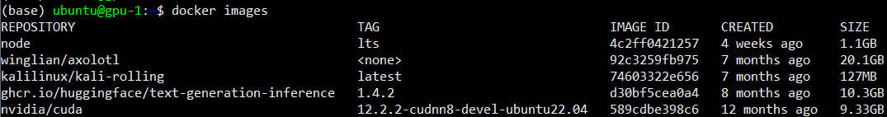

## 1. 개발 환경 구성

모든 과정은 Pytorch 및 GPU가 정상작동하는 컨테이너 환경에서 구동됩니다.

학습 및 테스트를 진행한 환경의 정보는 다음과 같습니다. 

OS : Ubuntu 22.04

GPU : NVIDIA H100 80GB

CUDA : 12.2

cuDNN : 8.9.6

Driver Version : 535.104.12

모든 명령어와 설정은 본인의 환경에 맞게 조정이 필요함을 말씀드립니다.

### (1) 컨테이너 관련 설정

1. 이미지 다운로드
    - 예) `docker pull nvidia/cuda:12.2.2-cudnn8-devel-ubuntu22.04`

        

2. 컨테이너 생성
    - 예) `docker run -it -d --gpus all -p 10088:8888 -p 10555:5000 --name test_workspace <image id> /bin/bash`

        

3. 컨테이너 접속
    - 예) `docker exec -it test_workspace /bin/bash`

        

4. 디렉토리 생성 및 이동
    - 생성 예) `mkdir workspace`
    - 이동 예) `cd workspace`
    - 컨테이너 생성시 마운트로 바로 지정하여도 무방합니다.
        
    
5. 컨테이너 내부 패키지 업데이트 및 설치
    
    ```bash
    apt-get update
    apt-get install -y git curl wget python3-pip
    ```
    

### (2) 코드 가져오기

1. git lfs 설치
    - wget https://github.com/git-lfs/git-lfs/releases/download/v2.13.3/git-lfs-linux-amd64-v2.13.3.tar.gz
    - tar xvfz git-lfs-linux-amd64-v2.13.3.tar.gz
    - ./install.sh

        
2. git clone https://github.com/etri/FeDiT.git
3. 경로 이동 : FeDiT/OSFW/DTAI_m2m/Source/

### (3) 주피터 사용 환경 구축

1. 라이브러리 설치
    - 예) `pip install jupyterlab`
2. 실행
    - 예) `jupyter lab --ip=0.0.0.0 --port=8888 --allow-root`
    - 실행 시 생성된 Token은 접속 시 요구되는 패스워드입니다.
        
        
        
3. 접속
    - 토큰 입력 및 패스워드 생성 후 접속 가능
        
        
        
    - 접속 화면
        
        
        

### (4) 관련 필수 라이브러리 설치

```bash
# 라이브러리 관련 툴 poetry 설치
curl -sSL https://install.python-poetry.org | python3 -

# 환경변수에 추가
export PATH="$HOME/.local/bin:$PATH"

# vim 설치
apt-get install -y vim

# bashrc 열기 
vim ~/.bashrc

# 다음 명령어 추가 후 저장
export PATH="$HOME/.local/bin:$PATH"

# 현재 셀 세션에 적용
source ~/.bashrc

# 관련 라이브러리 설치
poetry install

# my_poetry_env 라는 이름으로 ipykernel 추가
poetry run python -m ipykernel install --user --name=my_poetry_env

# python-opencv 관련 라이브러리 추가설치
apt-get install -y libgl1-mesa-glx
apt-get install -y libglib2.0-0
```

## 2. 실행

### (1) 학습 및 테스트 수행

(참고) 주피터 노트북에서 실행 시, 이전에 생성한 my_poetry_env 라는 ipykernel 선택 필수

1. CFD 폴더 이동
2. 0_데이터세트생성.ipynb 순차적 실행
    - 라이브러리 import
    - 데이터세트 가져오기
    - 데이터세트 전처리
3. 1_학습 및 테스트.ipynb 순차적 실행
    - 라이브러리 import
    - 데이터세트 로드
    - 모델 지정
    - 각종 파라미터 지정
    - 학습 및 테스트 수행

### (2) 1차 PoC 테스트 (미세 먼지 예측)

1. POC 폴더 이동
2. `poetry run python poc.py` 
3. request 테스트
    
    
    
    - request 파라미터
        - time_len : 예측할 시간 (단위:hour)
        - pm10 : 12개 포인트에 대한 pm10 수치값
        - pm25 : 12개 포인트에 대한 pm2.5 수치값
        - fdo_id : 관광지 위치 정보
    - response
        - data_time : 예측 시간
        - fdo_id : 관광지 위치 정보
        - pm_total_level : pm 수치 정도
